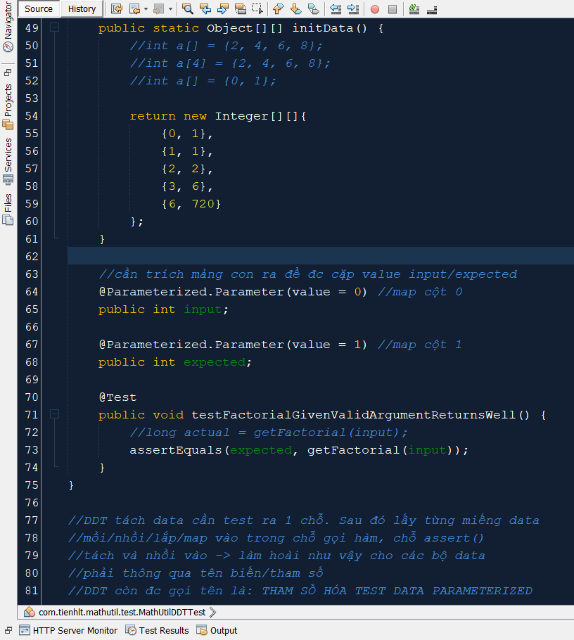

# Welcome to Math Utility Repository

## This repo stores a Java library to support for the Math calculation. You will find in this repo the following stuff

- MathUtil class to offer the basis math operations. E.g. compute a factorial,...
- CI (Continuous Integration) configuration
- Source code to demo TDD/DDT technique
- .gitignore file to demo the feature of selection something to upload 
- README.md file to demo how to show a description of a repo by default

##### &copy; tienhuynh-tn 2022

### Screenshots:

